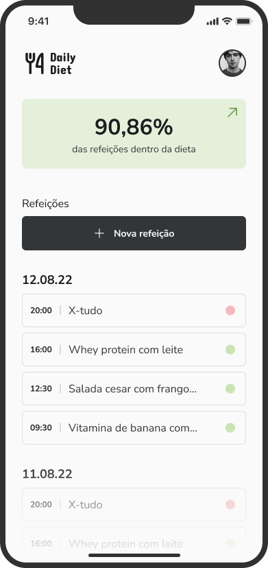

# Daily Diet Mobile

  
  

O **Daily Diet Mobile** é um aplicativo para controle de refeições diárias, onde o usuário pode registrar suas refeições e verificar se elas estão dentro da dieta ou não. O foco do aplicativo é facilitar o acompanhamento de hábitos alimentares e ajudar o usuário a manter um estilo de vida saudável.

## 📱 Funcionalidades

-   Registro de refeições com descrição, data e hora.
-   Indicação visual se a refeição está dentro ou fora da dieta.
-   Agrupamento e exibição das refeições por data.
-   Exibição da maior sequência de refeições dentro da dieta.
-   Edição e remoção de refeições.
-   Modal para seleção de data e hora ao registrar uma refeição.

## 🚀 Tecnologias Utilizadas

Este projeto utiliza as seguintes tecnologias e bibliotecas:

-   **React Native**: Framework para desenvolvimento mobile.
-   **TypeScript**: Superset do JavaScript que adiciona tipagem estática ao código.
-   **React Navigation**: Navegação entre as telas do aplicativo.
-   **React Hook Form**: Biblioteca para lidar com formulários e validação de inputs.
-   **DateTimePicker**: Componente para seleção de data e hora.
-   **AsyncStorage**: Armazenamento local de dados para persistência das informações.
-   **Nativewind (Tailwind CSS )**: Estilos com classes utilitárias para uma UI mais rápida e eficiente.

## 🔧 Instalação e Execução

Siga os passos abaixo para rodar o projeto localmente:

1.  Clone o repositório:
    
    bash
    
    Copiar código
    
    `git clone https://github.com/RafaelFigueiredo2203/daily_diet_mobile.git` 
    
2.  Acesse a pasta do projeto:
    
    bash
    
    Copiar código
    
    `cd daily_diet_mobile` 
    
3.  Instale as dependências:
    
    bash
    
    Copiar código
    
    `npm install` 
    
4.  Execute o projeto:
    
    bash
    
    Copiar código
    
    `npx expo start`
